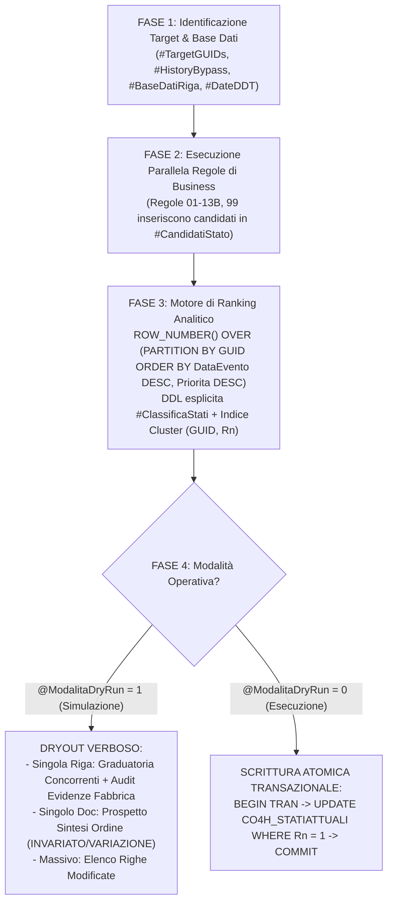

# KNOWLEDGE BASE TECNICA: ENGINE STATI RIGA (SP [dbo].[SPSO_AGGIORNA_STATI_RIGA_GEMINI])

> **ATTENZIONE AGENTE AI**: Questo documento è redatto ad uso esclusivo dell'Agente per massimizzare la comprensione del contesto, l'autonomia decisionale e l'efficienza nelle sessioni di sviluppo e manutenzione relative alla Stored Procedure `[dbo].[SPSO_AGGIORNA_STATI_RIGA_GEMINI]`.
> Leggere attentamente questo file prima di proporre o implementare qualsiasi modifica.

---

## 1. Coordinate dell'Oggetto e Ambiente di Riferimento

- **Oggetto SQL**: `[dbo].[SPSO_AGGIORNA_STATI_RIGA_GEMINI]`
- **Tipologia**: Stored Procedure (Core Engine)
- **Database di Target**: `DBTMV`
- **Istanza Server Ufficiale**: `NB-BANDERA\SQL2019`
- **Versione Compatibilità**: Microsoft SQL Server 2017 (MSSQL 14.0.2120.1)
- **Autore di Riferimento**: `SOLVERIS - Bandera Marco`
- **Ultima Revisione Rilasciata**: **Rev. 31** (Data: 2026-09-15)
- **File Sorgente nel Workspace**:
  `c:\Users\marco\OneDrive\Documenti\READYTEC\TMV\VSCODE - TMV\STATI - RIGA\SPSO_AGGIORNA_STATI_RIGA_GEMINI.sql`

---

## 2. Scopo di Business e Flusso Gestionale

La Stored Procedure calcola e aggiorna deterministicamente lo **stato di avanzamento di ogni singola riga di Impegno Cliente (TipoDoc = 21)** all'interno della tabella `CO4H_STATIATTUALI` (con tracciamento storico in `CO4I_STATISTORICO`), correlando eventi fisici, di fabbrica e logistici:
1. **Commerciale**: Inserimento riga impegno (10045/10046).
2. **Ufficio Programmazione Produzione**: Emissione ODL di fabbrica (TipoDoc = 24 -> 10051).
3. **Officina Meccanica Interna (MES)**: Avanzamento fasi tecnologiche interne (taglio, smussatura, tornitura, rullatura -> 10073).
4. **Collaudo Qualità Metrologico**: Esecuzione fase tecnologica speciale 4031 (-> 10080).
5. **Logistica Conto Lavoro Esterno**: Fasi terzisti (trattamenti termici, galvanica, verniciatura), DDT c/lavoro (TipoDoc = 25/13), rientri e smistamenti (10069, 10070, 10074, 10072, 10075 / tratt. 2: 10081, 10071, 10082, 10078, 10083).
6. **Magazzino Versamento Prodotti Finiti**: Consolidamento Fase 6000 RTP (Ready To Package / Versamento Magazzino -> 10052).
7. **Magazzino Spedizioni**: Prelievo in Packing List (TipoDoc = 9/1 -> 10063/10076), Avviso Merce Pronta AMP (TipoDoc = 2 -> 10062), Spedizione definitiva con DDT (TipoDoc = 1 o 5/2 -> 10053 Totale / 10084 Parziale).

---

## 3. Tabella dei Codici Stato (`CO4C_STATI`)

| ID Stato | Nome Stato Funzionale | Priorità Nativa | Tipo/Reparto | Note e Comportamento Particolare |
| :---: | :--- | :---: | :--- | :--- |
| **10045** | Bozza / Non Confermato | - | Commerciale | Stato iniziale pre-conferma |
| **10046** | Inserito / Confermato | 0 | Commerciale | Ordine confermato, in attesa di DIBA/ODL |
| **10055** | DIBA Non Necessaria | - | Porto Sicuro | Articolo che non richiede distinta base; **Safe Harbor (mai alterare)** |
| **10051** | ODL Generato | 1 | Pianificazione | Emesso ODL TipoDoc 24, non ancora avviato alle macchine |
| **10073** | In Produzione | 2 | Officina MES | Almeno una fase interna (`PD12_INDTIPOPROV = 0`) consolidata (`DO46_QTA1CONSOLID > 0`) |
| **10080** | Collaudo | 3 | Qualità | Consolidamento su Fase speciale 4031 |
| **10069** | Attesa Invio C/Lav (Tratt. 1) | 4 | Conto Lavoro | Avanzamento su Fase 4011 |
| **10081** | Attesa Invio C/Lav (Tratt. 2) | 4 | Conto Lavoro | Avanzamento su Fase 4012 |
| **10070** | Uscito C/Lav (Tratt. 1) | 5 | Conto Lavoro | Emesso DDT C/Lavoro (TipoDoc 25, STipoDoc 13) |
| **10071** | Uscito C/Lav (Tratt. 2) | 5 | Conto Lavoro | Emesso secondo DDT C/Lavoro |
| **10074** | In Lavorazione Terzista (1) | 6 | Conto Lavoro | Carico c/lavoro fornitore registrato |
| **10082** | In Lavorazione Terzista (2) | 6 | Conto Lavoro | Carico secondo c/lavoro fornitore |
| **10072** | Rientro C/Lav (Tratt. 1) | 7 | Conto Lavoro | Avanzamento su Fase 4013 |
| **10078** | Rientro C/Lav (Tratt. 2) | 7 | Conto Lavoro | Avanzamento su Fase 4014 |
| **10075** | Smistato C/Lav (Tratt. 1) | 8 | Conto Lavoro | Avanzamento su Fase 4021 |
| **10083** | Smistato C/Lav (Tratt. 2) | 8 | Conto Lavoro | Avanzamento su Fase 4022 |
| **10052** | RTP / Versato a Magazzino | 9 (99 su Fake) | Produzione/Mag. | Fase 6000 consolidata; **Safe Harbor per Regola 99** |
| **10063** | In Packing List (PKL) Totale | 10 (11 Descr.) | Logistica | Documento TipoDoc 9, STipoDoc 1 collegato (Qta >= Qta Ordine) |
| **10076** | In Packing List (PKL) Parziale| 10 | Logistica | PKL collegata con Qta residua ancora da prelevare |
| **10062** | Avviso Merce Pronta (AMP) | 12 | Logistica | Documento TipoDoc 2 collegato |
| **10053** | Spedito Totale | 13 | Spedizioni | DDT (TipoDoc 1) o Fattura Accompagnatoria (TipoDoc 5, STipoDoc 2) con Qta >= Qta Ordine |
| **10084** | Spedito Parziale | 13 | Spedizioni | DDT emesso con Qta < Qta Ordine (residuo ancora da consegnare) |
| **10054** | Ordine a Fornitore | - | Acquisti | **Safe Harbor** (gestione riga d'acquisto speciale) |
| **10068** | Riga Annullata | - | Commerciale | **Terminale assoluto** (riga annullata da gestionale, intoccabile) |
| **10079** | C/Lavoro Esterno Virtuale | - | Produzione | **Safe Harbor** nel pattern "Fake ODL" |

---

## 4. Architettura dell'Engine in 4 Fasi



### Dettaglio FASE 1 (Filtri e Materializzazione)
- **Modalità Debug**:
  - `@DebugTipoFocus = 'RIGA'`: isola un singolo `DO30_GUID` corrispondente a `@DebugNumReg` e `@DebugRiga`.
  - `@DebugTipoFocus = 'DOCUMENTO'`: isola tutte le righe dell'ordine `@DebugNumReg` (anche quelle con stati terminali o safe harbor per consentire la diagnosi completa).
- **Modalità Massiva**:
  - Esclude a monte i terminali irreversibili: `CO4H_IDSTATO_CO4C NOT IN (10053, 10068, 10055)`.
  - **Eccezione Salvaguardia 10053 riaperti**: Rinclude le righe attualmente marcate a 10053 ma che hanno `DO72_FLGDAEVADERE = 1` oppure tipologia speciale (`DO30_INDTIPORIGA IN (2, 4, 6, 8)`: kit, spese, descrittive).
- **Materializzazione `#DateDDT` (Ottimizzazione Rev. 29-30)**:
  - Scansiona le date DDT di conto lavoro (TipoDoc 25, STipoDoc 13) **esclusivamente** per le righe presenti in `#BaseDatiRiga` (anziché l'intero archivio storico), garantendo seek istantaneo tramite predicato `DO33_DITTA_CG18`.

### Dettaglio FASE 2 (Le 14 Regole di Business)
Ogni regola controlla una specifica prova documentale ed effettua una `INSERT INTO #CandidatiStato`:
- `Regola 01`: ODL collegato in `DO33` con `DO11_TIPODOC = 24` e `DO31_INDSTATOCONS <> 9`.
- `Regola 02`: Fasi interne avanzate (`PD12_INDTIPOPROV = 0`, `DO46_CODSEQFASE < LIM.SEQ_LIMITE`, `DO46_QTA1CONSOLID > 0`).
  - **DataEvento**: `MAX(DO57_DATAMOV)` dell'avanzamento MES (fallback: data ODL).
  - **Tre Salvaguardie Obbligatorie**:
    1. Stato attuale non logistico (`NOT IN (10063, 10076, 10062, 10053, 10084, 10068, 10055, 10054)`);
    2. Impegno cliente non totalmente evaso (`DO72_FLGEVASO = 0 OR DO72_FLGDAEVADERE = 1`);
    3. Fase 6000 non consolidata (`DO46_QTA1CONSOLID < DO46_QTA1ORD`).
- `Regola 03`: Fase 4031 con consolidato `> 0`.
- `Regola 04 - 08`: Sequenza fasi conto lavoro e DDT di conto lavoro (`#DateDDT`).
- `Regola 09`: Fase 6000 consolidata `> 0` (RTP).
- `Regola 09B`: Fake ODL Process identificato in `#HistoryBypass` (sequenza storica 10046 -> 10079 -> 10052, priorità forzata a 99).
- `Regola 10`: Packing list (TipoDoc 9, STipoDoc 1) collegata via `DO33`.
- `Regola 11`: Articoli fittizi/descrittivi (spese trasporto, imballi) collegati a riga madre in PKL.
- `Regola 12 / 12B`: Avviso Merce Pronta (TipoDoc 2).
- `Regola 13 / 13B`: Spedizione definitiva tramite DDT (TipoDoc 1) o Fattura Accompagnatoria (TipoDoc 5, STipoDoc 2), sia diretta che tramite deposito (`DC-DDTCARDEPCL` collegato).
- `Regola 99`: Universal Rollback / Paracadute Storico (interroga `CO4I_STATISTORICO` a ritroso se nessun'altra regola ha prodotto candidati, ignorando i Safe Harbors 10052, 10079, 10054, 10068, 10055).

### Dettaglio FASE 3 (Ranking e DDL Esplicita)
- Criterio di risoluzione conflitti:
  ```sql
  ROW_NUMBER() OVER (
      PARTITION BY DO30_GUID 
      ORDER BY DataEvento DESC, PrioritaSequenza DESC
  ) AS Rn
  ```
- Vince sempre l'evento cronologicamente più recente (`DataEvento DESC`).
- In caso di perfetta parità di data, vince lo stato situato più a valle nel flusso gestionale (`PrioritaSequenza DESC`).
- Il candidato con `Rn = 1` viene eletto **Vincitore Assoluto**.

---

## 5. Le Trappole Critiche e "Gotchas" da Ricordare Assolutamente

### ⚠️ TRAPPOLA 1: `DO31_INDSTATOCONS = 3` in Alyante/TeamSystem (NON reinserire MAI!)
- **Errore Commesso in Rev. 27**: Si riteneva che `DO31_INDSTATOCONS = 3` significasse "ODL formalmente chiuso e archiviato", inserendo un `NOT EXISTS` su questo campo per inibire la Regola 02.
- **Realtà del Database**: In TeamSystem Enterprise, per i documenti ODL (TipoDoc 24), il valore `DO31_INDSTATOCONS = 3` identifica un ordine **confermato e lanciato in lavorazione**. Ben 4.437 righe ODL nel 2026 hanno questo stato!
- **Conseguenza**: Inibiva la Regola 02 per 2.277 righe attive in officina, facendo vincere la Regola 01 e retrocedendo spurie le righe da 10073 a 10051.
- **Regola Aurea**: La chiusura di un ODL è determinata dalla **Fase 6000 consolidata** (`DO46_QTA1CONSOLID >= DO46_QTA1ORD`) e dallo stato di evasione riga ordine (`DO72_FLGEVASO = 1`), MAI da `DO31_INDSTATOCONS = 3`.

### ⚠️ TRAPPOLA 2: Predicato di Ditta su `DO33_DOCCORPORIF` (Collo di Bottiglia I/O)
- Gli indici primari e covering su `DO33` (es. `IDX_DO33_COVERING_RIF_GEMINI`, `IDX02_DO33`) hanno come **prima colonna chiave `DO33_DITTA_CG18`**.
- Se si effettua una join senza specificare `R.DO33_DITTA_CG18 = B.DO30_DITTA_CG18_OC`, SQL Server **non può effettuare l'Index Seek** ed esegue un Index Scan massivo (oltre 524.000 scan e milioni di letture logiche con spill su workfile).
- **Regola Aurea**: Ogni singolo `ON` o predicato che coinvolge `DO33` DEVE SEMPRE contenere `DO33_DITTA_CG18 = <ditta_sorgente>`.

### ⚠️ TRAPPOLA 3: Errore 208 su Stima Piano di Esecuzione (`SELECT INTO #temp`)
- In SQL Server Management Studio (SSMS), quando un utente genera l'Estimated Execution Plan (`Ctrl + L` / `SHOWPLAN_XML`), le query vengono compilate ma **non eseguite**.
- L'uso di `SELECT * INTO #ClassificaStati FROM ...` impedisce al motore di acquisire lo schema della tabella temporanea a compile-time, generando:
  `Messaggio 208, Livello 16: Invalid object name '#ClassificaStati'`.
- **Regola Aurea**: Definire sempre la tabella temporanea con DDL formale:
  `CREATE TABLE #ClassificaStati (...)` seguita da `INSERT INTO #ClassificaStati SELECT ...`.

### ⚠️ TRAPPOLA 4: Collation su Tabelle Temporanee
- Tempdb potrebbe avere collation differente dal database `DBTMV`.
- **Regola Aurea**: Su tutti i campi `VARCHAR` o `CHAR` di tabelle temporanee applicare sempre esplicitamente `COLLATE DATABASE_DEFAULT`.

### ⚠️ TRAPPOLA 5: Nomi Colonne in `DO30_DOCCORPO`
- Il campo Ditta è **`DO30_DITTA_CG18`** (non `DO30_DITTA`).
- Il campo Descrizione è **`DO30_DESCART`** (non `DO30_DESCRIZIONE1` o `DO30_DESCRIZIONETESTO`).
- Lo stato documento **non è in DO30** ma in `DO11_DOCTESTATA`.

---

## 6. Standard e Regole di Comportamento (`GEMINI.md`)

1. **Default di Sicurezza**: `@ModalitaDryRun BIT = 1` deve rimanere sempre il valore predefinito nei parametri formali della procedura.
2. **Nomenclatura**:
   - Stored Procedure: `SPSO_<NOME>_GEMINI`
   - Tabelle personalizzate: `SO..._GEMINI`
   - Viste: `VPSO_..._GEMINI`
3. **Cartiglio Narrativo Obbligatorio**:
   - Autore fisso: `SOLVERIS - Bandera Marco`.
   - Sezione Change Log narrativo storico: **MAI troncare o eliminare** le revisioni precedenti (Rev. 1-30). Aggiungere sempre incrementale (es. Rev. 31, Rev. 32...).
4. **Letture Senza Lock**: Applicare sistematicamente `WITH (NOLOCK)` su tutte le tabelle reali coinvolte in letture.

---

## 7. Script di Collaudo Rapido (Cheat Sheet)

### A. Diagnostica Puntuale su Singola Riga (Output a Doppio Livello)
```sql
USE [DBTMV]
GO

DECLARE @RC int
DECLARE @ModalitaDryRun bit         = 1
DECLARE @DebugDitta int             = 1
DECLARE @DebugNumReg varchar(30)    = '202600168655'
DECLARE @DebugRiga int              = 1

EXECUTE @RC = [dbo].[SPSO_AGGIORNA_STATI_RIGA_GEMINI] 
   @ModalitaDryRun
  ,@DebugDitta
  ,@DebugNumReg
  ,@DebugRiga
GO
```
*Genera due result set*:
1. **Graduatoria Concorrenti**: elenca tutti i candidati in `#ClassificaStati` ordinati per `Rn`, evidenziando `VINCITORE ASSOLUTO` vs `CANDIDATO SUPERATO`, priorità e proposta di variazione.
2. **Audit Diagnostico Fabbrica**: elenca per ciascuna delle 14 regole se ha generato un candidato o il motivo puntuale dell'esclusione.

### B. Diagnostica su Intero Documento (Tutte le righe dell'ordine)
```sql
USE [DBTMV]
GO

EXEC [dbo].[SPSO_AGGIORNA_STATI_RIGA_GEMINI] 
   @ModalitaDryRun = 1,
   @DebugDitta = 1,
   @DebugNumReg = '202600168655';
```
*Genera un prospetto tabellare di sintesi con tutte le righe dell'ordine cliente e colonna `INVARIATO` / `VARIAZIONE`.*

### C. Compilazione della SP da Terminale PowerShell via `sqlcmd`
```powershell
sqlcmd -S "NB-BANDERA\SQL2019" -d DBTMV -i "STATI - RIGA\SPSO_AGGIORNA_STATI_RIGA_GEMINI.sql"
```
*(Usare `sqlcmd` da riga di comando per bypassare il limite di 100.000 caratteri di `mssql_execute`).*
